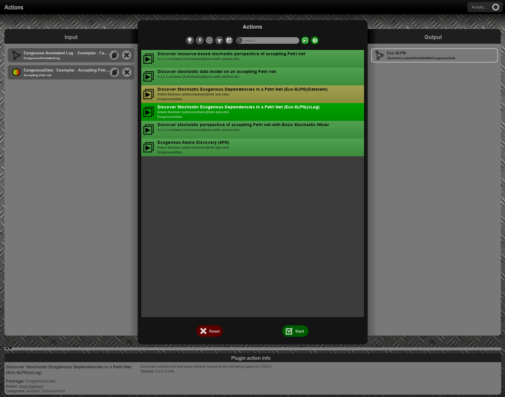
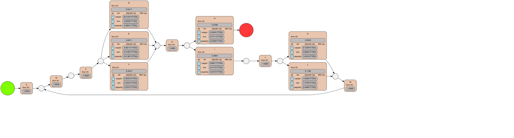
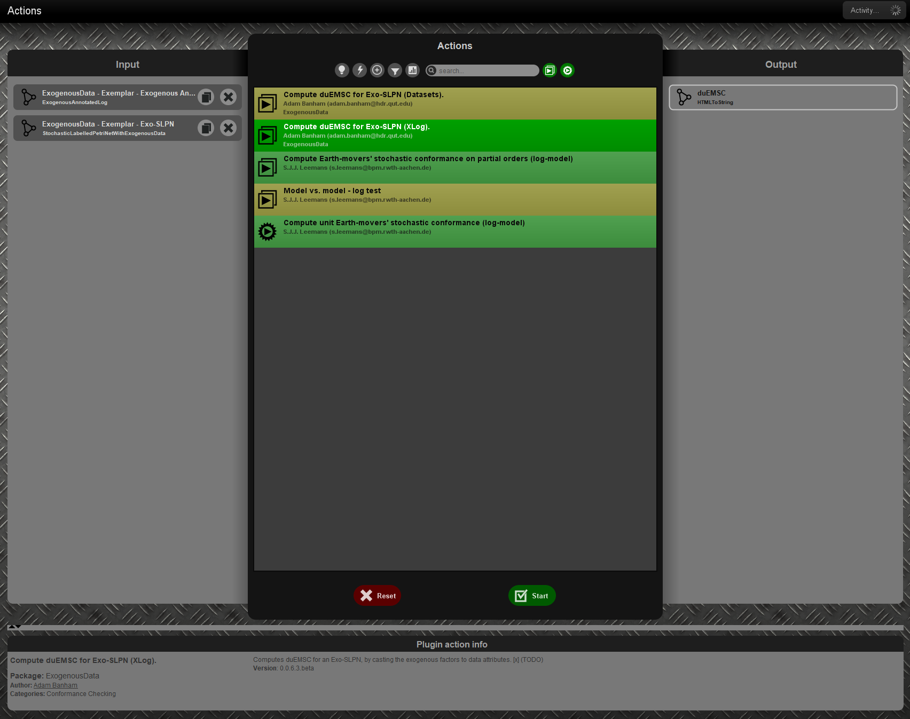

[](https://github.com/promworkbench/ExogenousData/actions/workflows/test_build.yml) [](https://github.com/promworkbench/ExogenousData/actions/workflows/release_build.yml) [](https://github.com/promworkbench/ExogenousData/actions/workflows/java_tests.yml)

# Exogenous Data ProM Plugin
***Developed by Adam P. Banham, orcid: 0000-0001-9912-8220***
<br>
This is a plugin for the ProM framework, which implements several tools 
around xPM, a framework for process mining with exogenous data [5]. One 
of the main features for this plugin is an interactive interface for 
several steps of the framework. i.e. viewing an xlog, performing decision 
mining with exogenous data and generating Explorative Exogenous Signal 
Anylsis (EESA) visualisations (and ranking a collection). While this plugin 
creates a user-friendly way to interface with the xPM framework, the inputs 
and outputs (exo-panels and their creations) are still somewhat ad-hoc. 
Furthermore, only a limited set of transformers and slicers are supported. 
Please get in contact if you require assistance with the creation of
 exo-panels or exo-descriptions, or non-trivial options for creating 
 determinations in a xPM instantiation.
 
 ## List of GUI exposed techniques

Below is a list of GUI exposed techniques if the plugin is installed into 
a local ProM instance, i.e. using the PackageManager for ProM.
 
| GUI name | Technique | Parameters | Description | Paper |
|----------|-----------|-------------|-------| --- |
|Exogenous Annotated Log Preparation (XLogs)| xPM - log processing | Endogenous Log, Many XES Logs (Exogenous Candidates) | Given an event log and several exo-panels, this plugin allows users to define determinations as identified by xPM [1] and apply them to create an ExogenousAnnotatedLog. This plugin will convert the given xes logs into ExogenousDataset Objects. | [6] |
|Exogenous Annotated Log Preparation | xPM - log processing | Endogenous Log, Many ExogenousDatasets | same as above | [6] |
|Exogenous Annotated Log Preparation (AIIM 2022) (XLogs)| xPM - log processing | Endogenous Log, Many XES Logs (Exogenous Candidates) | This plugin allows users to reproduce the xPM instantition used in [6,7] | [6,7] |
|Exogenous Annotated Log Preparation (AIIM 2022)| xPM - log processing | Endogenous Log, Many ExogenousDatasets | same as above | [6,7] |
|Exogenous Annotated Log Preparation (Exemplar) (XLogs) | xPM - log processing |  Endogenous Log, Many XES Logs (Exogenous Candidates) | Given an event log and several exo-panels, this plugin allows users to reproduce the exemplar configuration used in the repo [examplar](exemplar/readme.md) | [5] |
|Exogenous Annotated Log Preparation (Exemplar)| xPM - log processing | Endogenous Log, Many ExogenousDatasets | same as above | [5] |
|Make Log into Exogenous Dataset| xPM - log processing | XES Log | This plugin allows a user to create an ExogenousDataset from a parsed XES log, assuming that it was formatted appropriately [Appendix B.1.1, 5]. | [5] |
|Describe Exogenous Dataset| xPM, visualiser | ExogenousDataset | This plugins creates a screen showing some basic information and statistics about a given ExogenousDataset | [5] |
|Exogenous Annotated Log Explorer | xPM, visualiser | ExogenousAnnotatedLog |  This plugin allows users to explore an ExogenousAnnotatedLog through a GUI, including several screens to dive down to the event log of each annotated trace | [6] |
|Exogenous Aware Discovery (DPN)| xPM, visualiser, decision mining, process enhancement | ExogenousAnnotatedLog, PetriNetWithData | This plugin allows users to perform various process enhancement and discovery methods using an ExogenousAnnotatedLog and a control flow description. | [5,6] |
|Exogenous Aware Discovery (PN)| same as above | ExogenousAnnotatedLog, Petrinet| same as above, but will create a dummy PetriNetWithData from the Petrinet with naively true guards | [5,6] |
|Exogenous Aware Discovery (PT)| same as above | ExogenousAnnotatedLog, ProcessTree| same as above, but will unfold the ProcessTree into a Petrinet, then create a dummy PetriNetWithData from the unfolded Petrinet| [5,6] |
|Exogenous Aware Discovery (APN)| same as above |  ExogenousAnnotatedLog, AcceptingPetriNet| same as above, but will convert the AcceptingPetriNet into a dummy PetriNetWithData | [5,6] |
|(Non) Exogenous Aware Discovery (DPN) | same as above | XLog, PetriNetWithData | same as above, but will convert the given XLog into an ExogenousAnnotatedLog with no exogenous data so that decision mining techniques can be used in the GUI form | [5,6] |
|Generate Playout Transition Tree (DPN)| conformance checking | PetriNetWithData, k (int) | Computes a playout transition tree for a given graph with a maximum playout length of k | [4,5] |
|Generate (Many) Playout Transition Trees (DPN) | conformance checking |  PetriNetWithData, k (int) | same as above, but will repeat the construction 25 times for testing purposes on runtime. | [4,5] |
|Compute determinism of a DPN| conformance checking | PetriNetWithData | Computes the determinism of a Petri net with guards, which may be a Petri net with data. Determinism computes the portion of transitions that are in the postset of places with at least two outgoing arcs and which have a non-trivial guard. | [5] |
|Compute guard-recall of a DPN| conformance checking | PetriNetWithData, XLog | Computes the guard-recall of a Petri net with guards, which may be a Petri net with data. Guard-recall computes the portion of guards that were  true when the corsponding playout tree is traversed for traces in the log | [4] |
|Compute guard-precision of a DPN| conformance checking| PetriNetWithData, XLog | Computes the guard-recall of a Petri net with guards, which may be a Petri net with data. Guard-precision computes the portion of guards that were only true when for the travesed path in the corsponding playout tree for traces in the log. | [4] |
|(Prettier) Transition Tree Visualiser | visualiser | PNWDTransitionTree | Visualising the given playout transition tree using dot (Graphviz). | [5] |
|Discover Stochastic Exogenous Dependencies in a Petri Net (Exo-SLPN)(xLog)| process enhancement, stochastic process mining | ExogenousAnnotatedLog, AcceptingPetriNet | This plugin allows users to enhance a AcceptingPetriNet into a StochasticLabelledPetriNetWithExogenousData (Exo-SLPN), by deriving parameterised weight functions for each transition in the net. The user can select several options for the form of these weight functions. | [?] |
|Discover Stochastic Exogenous Dependencies in a Petri Net (Exo-SLPN)(Datasets)| process enhancement, stochastic process mining | XLog (Endogenous Log), AcceptingPetriNet, Many ExogenousDataset | same as above, but only the supplied ExogenousDatasets are used to form weight functions | [?] |
|Compute duEMSC for Exo-SLPN (Datasets)| conformance checking, stochastic process mining | XLog (Endogenous Log), StochasticLabelledPetriNetWithExogenousData, Many ExogenousDataset | This plugin allows users to quantify the quality of a discovered Exo-SLPN by using the data-aware Unit Earth Mover's conformance measure. | [?] |
|Compute duEMSC for Exo-SLPN (XLog)| conformance checking, stochastic process mining | ExogenousAnnotatedLog, StochasticLabelledPetriNetWithExogenousData | same as above, but will use all annotated datasets. | [?] |
|(Prettier) Stochastic labelled Petri net with Exogenous Data visualisation| visualiser | StochasticLabelledPetriNetWithExogenousData | Visualises an Exo-SLPN using dot (Graphviz). | [?] |
|Stochastic labelled Petri net with Exogenous Data visualisation | visualiser | StochasticLabelledPetriNetWithExogenousData | Visualises an Exo-SLPN, in a simple form, using dot (Graphviz) (Graphviz). | [?] |
|StochasticLabelledPetriNetWithExogenousData Importer| parser | InputStream | Reads a file to create an Exo-SLPN | [?] |
|StochasticLabelledPetriNetWithExogenousData Expoert| serialiser | StochasticLabelledPetriNetWithExogenousData, File | Serialises an Exo-SLPN into a .slpned file | [?] |

## Development

The development cycle for this plugin, is that only 
[major releases](https://github.com/promworkbench/ExogenousData/releases) 
are pushed to the nightly build of ProM. We tag released versions and an 
automated workflow action builds the source required for ProM installations.
If you do run into any issues using our plugin, please attempt to 
reproduce the issue using the code in this repo for testing, as the nightly 
build may be several commits behind.

# Exemplar Usage

For thoses that are interested in seeing what the xPM framework can do or 
want to check out the plugin's tools, we have provided some exemplar logs 
and an video overview of the plugin.

See the following write up for more infomation on the exemplar use 
case [here](exemplar/readme.md).

## Eclipse or other build VM arguments for development

8GB should be enough to run test without any worry, likely could get away 
with  much less. lpsolve is required for many of the techniques, as 
alignments are used. For development purposes, the binaries are included in
`\lib`.

```bash
-ea -Xmx8G -XX:MaxPermSize=256m -Djava.library.path=. 
-Djava.util.Arrays.useLegacyMergeSort=true  -Djava.library.path=.\lib\
```

## Features 

The following features have been implemented and can be accessed within 
ProM via the appropriate plugin. The following sections outline 
plug-ins, features, and outcomes.

### Exogenous Annotated  Log Explorer

To create an exogenous annotated log (xlog), several plug-ins are supported and
are named in using the following convention : "Exogenous Annotated Log 
Preparation (Z) (X)", where Z might referred to known configuration, such as AIIM2022
, and X may referred to the type of input for the exo-panel, such as XLogs. 
Exo-panels can be provided in several formats, but the most common input is an 
XES formatted event log, where traces represent exo-series and events
represent exo-measurements.
Next, an interface for making determinations is presented to user, allowing the 
construction of determinations through a wizard.
Alternatively, configurations can be constructed programmatically using the 
builder pattern.

- Apply one of the following plug-in, "Exogenous Annotated Log Preparation..." 
  to construct determinations and anotate an eventlog:
  


- After which, a wizard will ask for the types of slicing functions to use, 
  these can be specified for a given exo-panel or generically over all panels


- Next, the wizard will ask for the transformation functions to use with slicing,
  again these can be specified for all slicing, or for a targeted X.


- Finally, the collection of determinations are applied to the log to create an
  xlog.


After linking, slicing and transforming is completed, the following visualiser,
"Exogenous Annotated Log Explorer", visualises xlog to explore endogenous and
exogenous data within the xlog. This plugin is also available from the dropdown
 visualiser list when viewing the object within ProM. When opened for the first
 time, the visualiser waits the user to select an endogenous trace on the left,
 by clicking on the chevrons denoting the sequence of events.
 
- Visualiser waits for an endogenous trace to be clicked on
  


After an endogensou trace has been selected, the right side will population and
show the exogenous data related to the trace's events.

- The right-side is populated with overview graph at right-top and a breakdown
  of the events at right-bottom,
  

  
- Clicking on a chevron in the breakdown at right-bottom, highlights the where
  the event is in the right-top.
  

  
- Clicking one of the buttons under the graph at right-top, will perform a 
  transformation on the shown exo-series (the exo-series shown are the original
  linked exo-series from the exo-panel)
  


For the graph shown at right-top, the button "export chart data" generates a
csv file for the revisualisation of the graph in other language, e.g. matplotlib
for python.

All graphs shown in this screen can be exported as png or svg for uses outside
ProM, by right clicking a graph and selecting "save as".


The exported graph:


#### Filtering Log Data
 
In the xlog explorer, the list of traces on the left can be filtered by the 
trace's concept:name, using the text box at left-bottom. Note this matching 
inspects that the concept:name starts with the given text and filtering occurs
on an enter press. 

On the breakdown screen at right-bottom, the individual slices are shown for 
events, or event if one is selected. These graphs can be filtered by exo-panel,
and the slices shown in these graphs can be filtered by the silicer type.
When no button has been pressed (green highlight) all slices are shown.


### Performing Exogenous Aware Discovery

Exploring exogenous data alongside endogenous traces is useful, but using
exogenous data to investigate the behaviour of processes is exciting.
The package explores the decision making in processes, using 
a process model (process tree, Petri net, Petri net with Data) and a
xlog, to understand if an annotation describes an exogenous influence on the
behaviour of the process.
To faciliate this exploration, a GUI interface is proposed through several
plug-ins, named in the following convention "Exogenous Aware Discovery (X)",
where X refers the input type of the process model. For thoses wishing to 
use the decision mining techniques without exogenous data, an event log can
be used instead of an xlog.


A key compontent to the techniques applied for techniques, are alignments,
and uses will be asked to map event labels to transition labels. Please ensure
to the check the mapping when the interface is initially set up, as a 
mismatch can have extreme follow on effects.
Best efforts have been taken to ensure that only one alignment is computed 
and is cached for other techniques.


Once the interface is set up from user confirmation of the mapping, an alignment
is precomputed (progress towards finishing is shown in the interface) and some
summary statistics to inform the decision point frequencies are computed.
The following compontents require that these steps are compelted before 
applying them and options won't become available until they are.


A visualisation of the current process model is shown at top-center, where 
decision points are highlighted in green. The visualisation uses the typically
DotPanel, which uses graphviz for layouting, so users should be aware that 
large complicated models will struggle to be visulised. The plus-side of using
the DotPanel is that many exports of the completed view can be used and users
can move around free and zoom into transitions.

The control panel at bottom-center enables users perform decision mining and
annotate transitions with new guards, each discovery will result in a new DPN
in the ProM workspace for users to continue their analysis.
The first tab selects a decision mining approach, the second tab selects the
variables to be used in forming guards, the third tab contains many parameters
for the underlying decision tree algorithm as well as some extra feature 
engineering steps.


At this stage, three types of decision mining approaches are supported:
  - Overlapping decision miner, as proposed by Felix Mannhardt et. al [1];
  - Discrimating decision miner, as proposed by M. de Leoni et. al [2];
  - and, the basic application of C4.5 as proposed by Quinlan, J. R. [3].

Limited support is supplied for future engineering efforts proposed by 
 to include features for time series data in decision mining. Further work 
 is need to fully support the ideas presented in the code base.

After selecting a miner, variables, and choosing a configuration, the button
"Start Decision Mining" will launch an investigation, which results in an
DPN being discovered and displayed in top-center.

#### Guard Visualisation

Guards are visualised on the transitions in the graph shown at top-center.
These guards are visualised in a way to encourage them to be read visually,
interperting the position of a guard in relation to either weakenings or
reinforcements (see Section V.B in [4]). These guards are read left to right,
where a blue box denotes a weakening, a red box denotes a strengthening, and
any other box denotes a guard.


For instance, the above visualisation for a transition "H" is annotated with
a weakening across, three guards, two reinforcements and a guard (R9) of 
"cost > 49996". This weakening is true, enabling the transition, if any of 
three are true.
The top reinforcement is true if both gurds R1 and R2 are true.
The bottom reinforcement is true if guards R4, R5, R6, R7 are true.
This visualisation in combination with the implemented decision miners, is
prone to producing tall guards rather than wide guards, due the implemtations
ORing between paths through the decision trees.


### Conformance Checking over outcomes

After an investigation (decision miner called and model updated with 
guards) is completed, the user quantify the quality of the resulting Petri 
net with Data. To help the understandability, the visualisation of the 
process model is updated to denote, for a measure,
how much the transition played a positive role within quantification.

To trigger quantification for an outcome, press the button "Measure Model".
Some quantifications will take longer than others, and all quantification 
methods to have seperate plug-ins that can be called instead if users wish
to streamline the process for scentific endevours.

Currently, the interface supports the following metrics:
  - Determinism, as proposed in [5].

Support for following will be implemented in ProM soon:
  - guard-recall, as proposed in [4];
  - guard-precision, as proposed in [4].


Each computed measure will be displayed at the top-left and across the screen, 
as shown above.
The overall metric will fill an outer semi circle when returning 1.0 and 
proportionally less for anthing else.
While, the inner semi-circle will be used to show how each individual 
decision point contributed towards the overall metric.

## Investigating a process model with exogenous data
***Currently undergoing work to improve implementation of interfaces***

To explore an outcome in more detail, the user can click the button labelled 
"Open Enhancement". After doing so, the user will be able to explore each 
transition in greater detail and view an EESAs for a transition (Overlapping 
variants at this stage are hard coded). 

 

To do so, a user needs to click on a transition in the process model 
visualisation (top) and the transition will be highlighted.

 

Furthermore, for each exo-panel and slicer, a popup can be used to showcase 
an Individual EESA (median with STD/IQR) or raw slice plot (not recommended 
when viewing large numbers of slices).

 

### Ranking a collection of EESA visualisation
A user can generate a ranking for overlapping EESA visualisations by clicking 
the button lablled "search". Then all transitions that have been visited will 
be pooled and used for the collection of EESAs. Ranking may take some time 
depending on the number of EESAs present in the collection.

 

After the ranking is completed, the ranking list (bottom-right) will be 
populated from rank 1 to rank n, to show where overlapping EESA were found. 
Then rank n+1 (bottom of the list with common= -1) show where non-overlapping 
EESAs exist. Clicking on a ranking item in the will highlight the transition it 
came from in the process model (top) and the EESA in question will be shown 
(bottom-left).

 

## Investigating exogenous influences using stochastic process mining

In many cases, behaviour in processes can be influenced by exogenous data as 
actors interpret contextual factors surrounding an execution. One approach to 
describe this phenomenon is to consider how the likelihood of actions changes 
based on the context of a given process execution. This approach allows one 
to consider if a noticeable change occurs with the introduction of exogenous 
data. One such operationalisation of this approach is to use stochastic process 
mining to derive weight functions which include exogenous data as an external 
factor.

This package implements a process discovery/enhancement technique to discover 
a stochastic labelled Petri net with exogenous dependencies or an Exo-SLPN. 
The details for this modelling formalism based on stochastic labelled Petri 
nets will be available in an upcoming publication [?]. The general idea of 
the approach is to derive a parameterised weight function for each transition 
to quantify the likelihood of firing given the context of a (maybe partial) 
process execution. Importantly, these weight functions can consider the 
temporal nature of exogenous data.

In order to discover an Exo-SLPN, users will need an exogenous annotated log. 
Then the plugin "Discover Stochastic Exogenous Dependencies in 
a Petri Net (Exo-SLPN)(XLog)" can be used to discover an Exo-SLPN, as seen 
below.



Also implemented is a visualisation for Exo-SLPNs, as shown below:



We have also implemented a conformance checking measure for our formalism to 
determine whether the discovered Exo-SLPN is suitable for further analysis. 
Using the same inputs used for discovery and the discovered net, the plugin 
called "Compute duEMSC for Exo-SLPN (Datasets)", shown below, computes a 
measure between 0.0 and 1.0. A score of 0.0 reports that the net's stochastic 
distribution does not capture the log's stochastic distribution, and 1.0 
reports that it completely matches and captures the log's distribution.


<br> 


## Issues

To request assistance in using this plugin or for clarification on a feature, 
create an issue with the label "help-requested".

## Feature Requests

To request new features to be implemented or where hard coding exists and 
should be removed, create an issue with the label "feature-request".


## Contact

To get in contact, see https://www.adambanham.io/contact for my current 
email addresses and socials.

# References

[1] F. Mannhardt, M. de Leoni, H. A. Reijers, and W.M.P. van der Aalst, "Decision mining
revisited - discovering overlapping rules", in CAiSE, ser. Lecture Notes in Computer
Science, vol. 9694, Springer, 2016, pp. 377–392 .
<br>
[2] M. de Leoni and W.M.P. van der Aalst, "Data-aware process mining: Discovering
decisions in processes using alignments", in SAC, ACM, 2013, pp. 1454–1461.
<br>
[3] J.R. Quinlan, "C4.5: programs for machine learning", Morgan Kaufmann, 1993.
<br>
[4] A. Banham, A. H. M. T. Hofstede, S. J. J. Leemans, F. Mannhardt, R. Andrews, and
M. T. Wynn, "Comparing conformance checking for decision mining: An axiomatic
approach", IEEE Access, vol. 12, pp. 60 276–60 298, 2024
<br>
[5] A. Banham, "Process mining with exogenous data", PhD Thesis, Queensland
university of techonology, 2024.
<br>
[6] A. Banham, S. J. J. Leemans, M. T. Wynn, and R. Andrews, “xPM: A framework for
process mining with exogenous data,” in ICPM Workshops, ser. Lecture Notes in Business
Information Processing, vol. 433, Springer, 2021, pp. 85–97
<br>
[7] A. Banham, S. J. J. Leemans, M. T. Wynn, R. Andrews, K. B. Laupland, and L. Shinners,
“xPM: Enhancing exogenous data visibility,” Artif. Intell. Medicine, vol. 133,
p. 102 409, 2022
<br>
[?] (Currently Unpublished) A. Banham et. al. Discovering Exogenous Influences on Decisions in Processes.